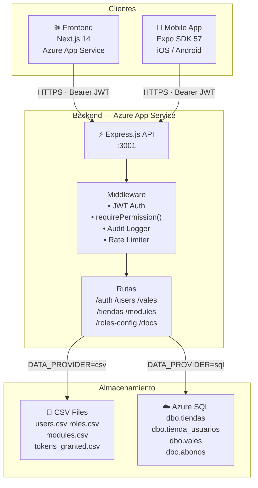
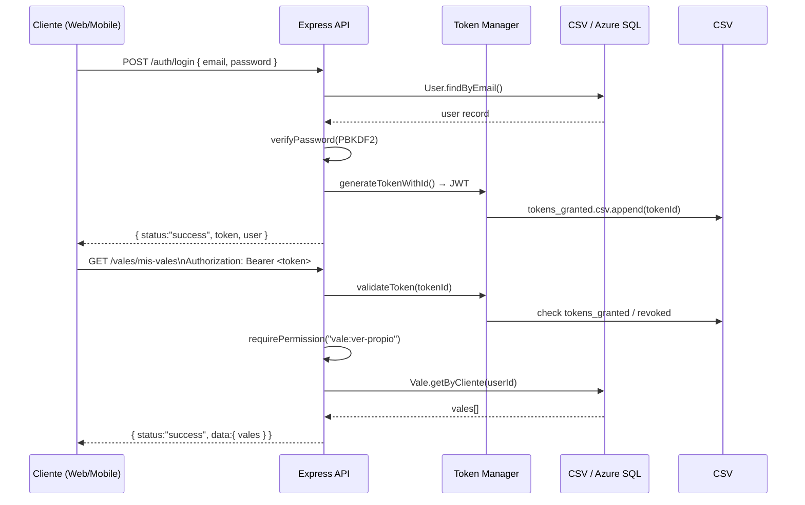
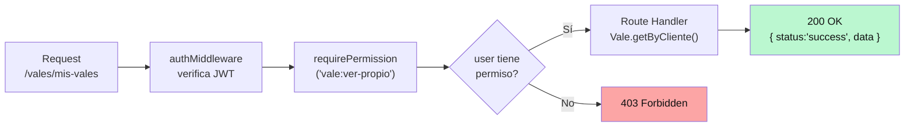

# Arquitectura del Sistema — Mi Valecito

## Diagrama General

## Flujo de Autenticación

## Flujo de Permisos

## Stack por Capa

| Capa | Tecnología | Notas |
|------|-----------|-------|
| Mobile | Expo SDK 57 + React Native | Zustand + SecureStore |
| Frontend | Next.js 14 App Router | SCSS + React Bootstrap |
| API | Express.js + Node.js | Dual-mode CSV/SQL |
| Auth | JWT + PBKDF2 | 24h / 30d (rememberMe) |
| DB dev | CSV files | Sin setup adicional |
| DB prod | Azure SQL | Requiere migración SQL |
| Hosting | Azure App Service | Brazil South |
