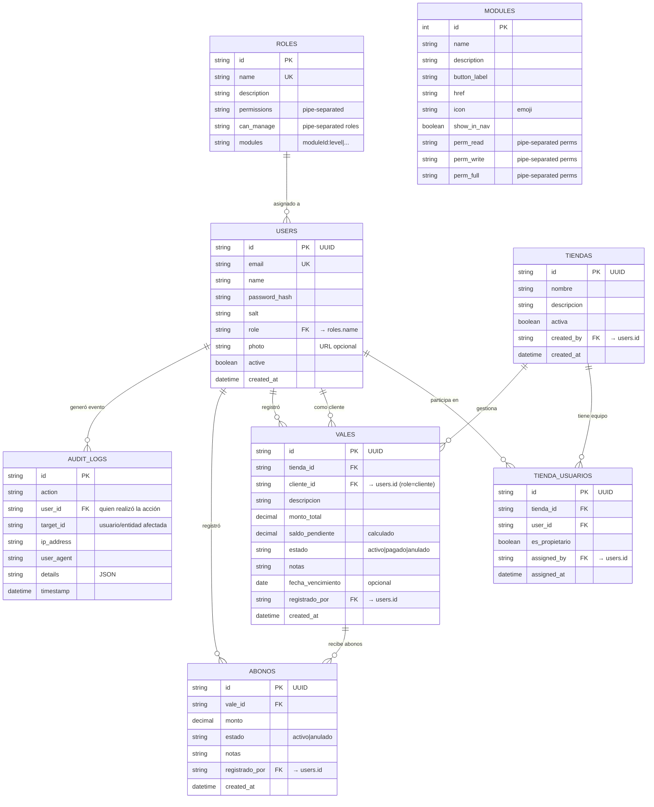
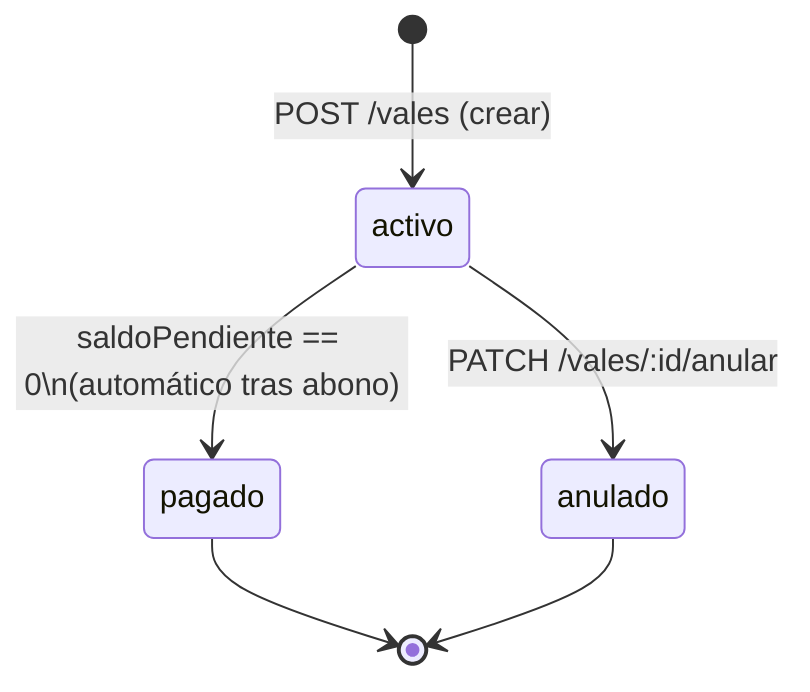
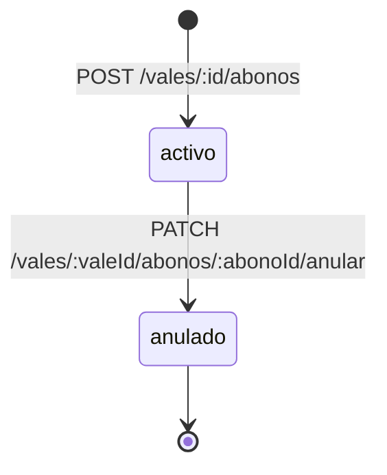
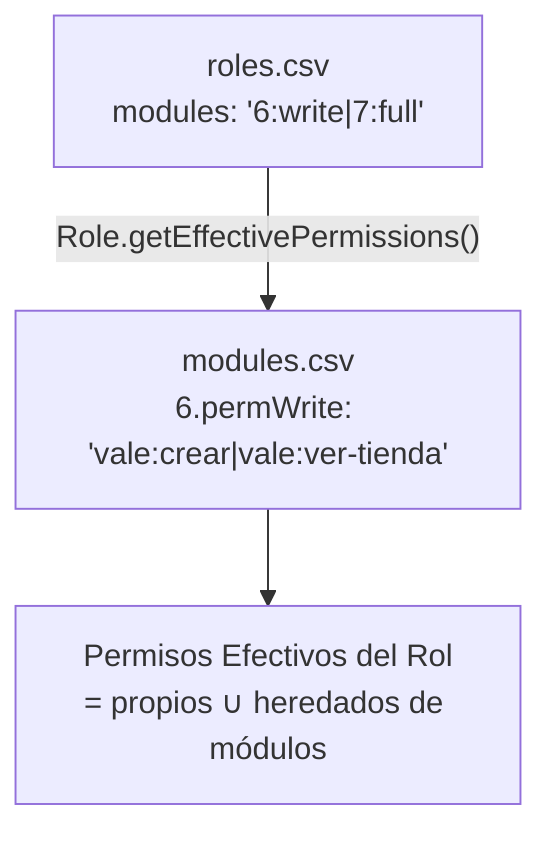

# Diagrama Entidad-Relación — Mi Valecito

> Las entidades `users`, `roles` y `modules` viven en archivos CSV en modo desarrollo.  
> Las entidades `tiendas`, `tienda_usuarios`, `vales` y `abonos` viven en Azure SQL (también disponibles en CSV en modo dev).

## Diagrama ER

## Estados del Vale

## Estados del Abono

## Herencia de Permisos (roles.csv → modules.csv)

