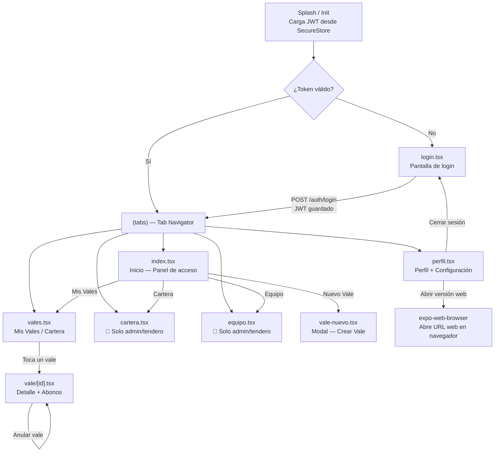
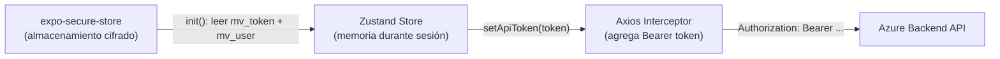

# Flujo de Pantallas — App Mobile

## Diagrama de Navegación

## Pantallas y sus Permisos

| Pantalla | Roles | API usada |
|---------|-------|-----------|
| login | todos (sin auth) | `POST /auth/login` |
| index (inicio) | todos | — |
| vales | todos | `GET /vales/mis-vales` (cliente), `GET /vales/tienda/:id` (admin/tendero) |
| cartera | superuser, administrador, tendero | `GET /vales/tienda/:id`, `GET /tiendas/mis-tiendas` |
| equipo | superuser, administrador, tendero | `GET /tiendas/:id/usuarios` |
| perfil | todos | `PATCH /auth/profile`, `PATCH /auth/change-password` |
| vale-nuevo | superuser, administrador, tendero, vendedor | `POST /vales` |
| vale/[id] | todos (con acceso al vale) | `GET /vales/:id`, `POST /vales/:id/abonos` |

## Almacenamiento en Dispositivo

